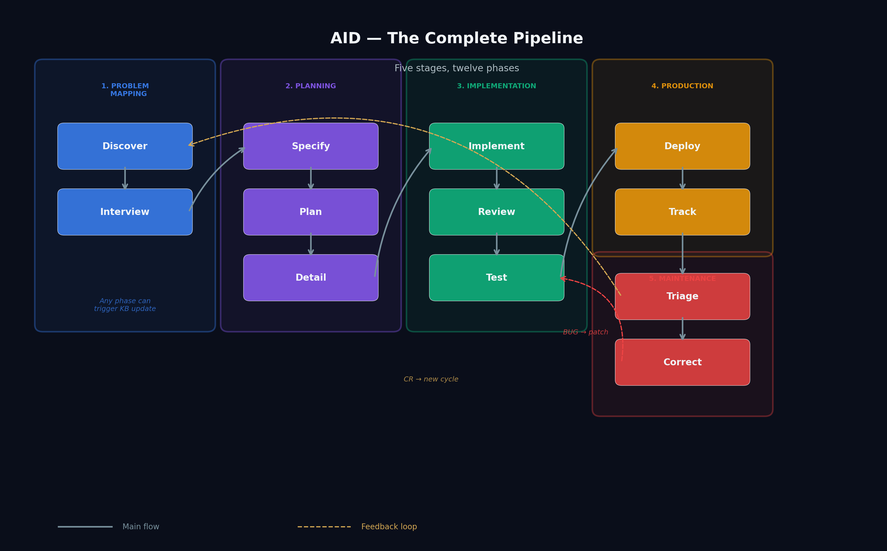
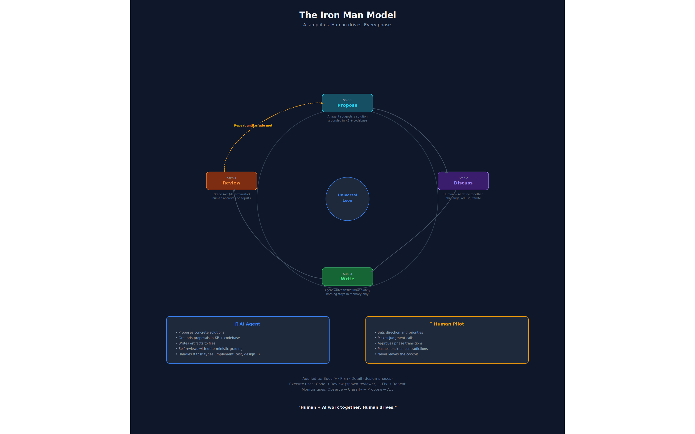
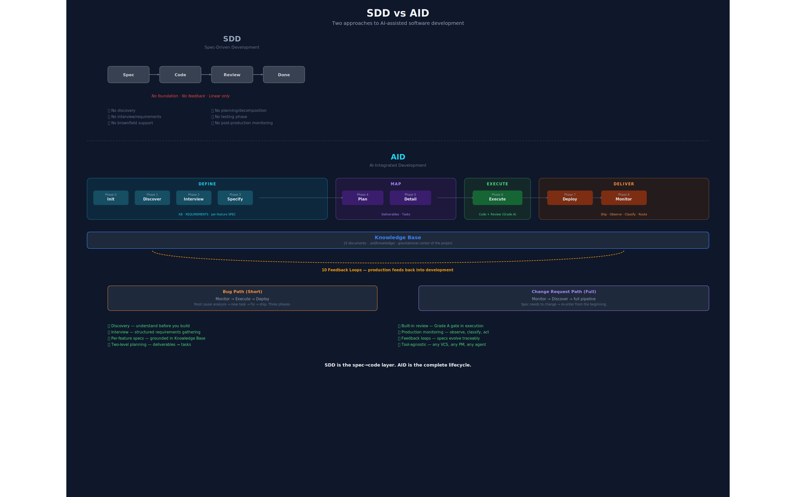
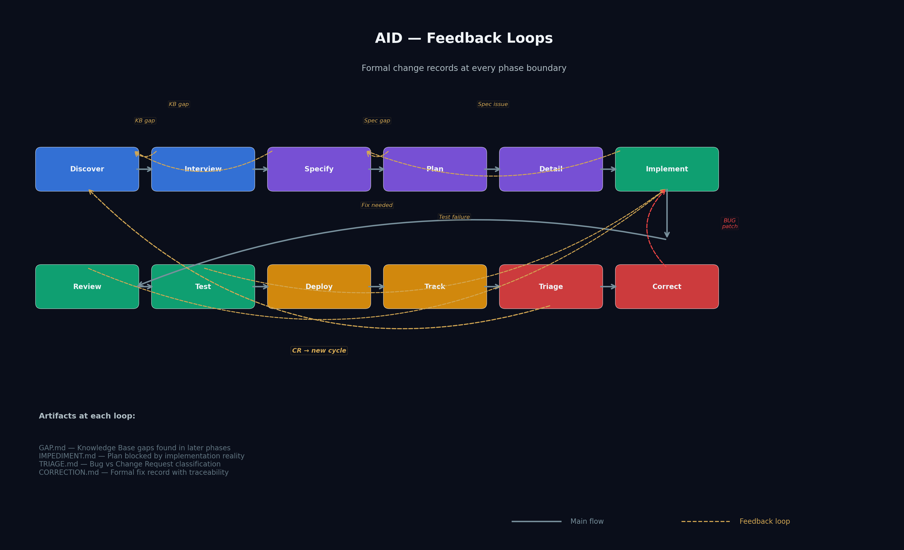

# AID — AI-Integrated Development

**The complete methodology for building software with AI agents. From discovery to production monitoring.**

---



---

## What is AID?

Software development with AI is mostly talked about as a code-generation problem. Write a spec, let the agent implement it, review the output. Done. Except it's not done — not even close.

AID (AI-Integrated Development) is a structured methodology that covers the **full lifecycle**: understanding an existing system, gathering requirements, writing grounded specifications, planning and detailing work, building with quality gates, shipping, and monitoring production. Twelve phases. Five groups. Eleven formal feedback loops that let any phase revise upstream artifacts when reality contradicts assumptions.

The methodology rests on three convictions. First: you cannot write a useful spec for a system you don't understand — and 90% of enterprise work is brownfield. Second: specs are hypotheses, not contracts — implementation reveals truths that specification cannot anticipate, so you need formal revision protocols, not silent workarounds. Third: the Knowledge Base is the gravitational center — not the spec, not the code, but the accumulated, living understanding of the project that persists across phases, sprints, and team changes.

AID is not "AI executes, human validates." It is human and AI working together across every phase, with the human as pilot — setting direction, making decisions, approving phase transitions. The AI is the Iron Man suit. The human never leaves the cockpit.



AID contains SDD (Spec-Driven Development). SDD is the spec→code layer. AID is the complete lifecycle — before the spec, during implementation, after deployment.

---

## Quick Start

**New to AID?** Start with the [methodology document](methodology/aid-methodology.md) — it's the complete V3 spec, ~40 minutes to read.

**Want to use the skills right now?**
```
skills/
├── aid-discover/SKILL.md     ← Start here for brownfield projects
├── aid-interview/SKILL.md    ← Start here for greenfield projects
└── ...                      ← Each phase is a self-contained SKILL.md
```

**Want templates for your project artifacts?**
```
templates/
├── knowledge-base/          ← 13 KB document templates
├── specs/                   ← SPEC.md template
├── delivery-plans/          ← PLAN.md, DETAIL.md, TASK templates
├── feedback-artifacts/      ← GAP.md, IMPEDIMENT.md, TRIAGE.md
└── reports/                 ← REVIEW, TEST-REPORT, TRACK-REPORT, CORRECTION
```

**Want to see it in action?**
```
examples/
├── brownfield-enterprise/   ← Discovery on a legacy Java monorepo
├── desktop-app/             ← Greenfield MVVM desktop application
└── data-pipeline/           ← Multi-agent operational pipeline
```

---

## The 12 Phases

### Group 1: Problem Mapping
| Phase | Skill | What It Does |
|-------|-------|-------------|
| 1. Discover | `aid-discover` | Analyzes an existing codebase; produces the Knowledge Base (13 documents) |
| 2. Interview | `aid-interview` | Adaptive one-question-at-a-time requirements gathering; produces REQUIREMENTS.md |

### Group 2: Planning
| Phase | Skill | What It Does |
|-------|-------|-------------|
| 3. Specify | `aid-specify` | Transforms requirements into a grounded SPEC.md anchored in the KB |
| 4. Plan | `aid-plan` | Defines MVP scope, modules, deliverables, test scenarios — strategy, not tactics |
| 5. Detail | `aid-detail` | Decomposes the plan into user stories, executable tasks, and precedence order |

### Group 3: Implementation
| Phase | Skill | What It Does |
|-------|-------|-------------|
| 6. Implement | `aid-implement` | Spawns a coding agent with full KB context; mandatory build verification |
| 7. Review | `aid-review` | Spec-anchored code review with A+ to F grading; auto-fixes P1/P2 issues |
| 8. Test | `aid-test` | Staging validation — E2E, integration, manual; the gate before deploy |

### Group 4: Production
| Phase | Skill | What It Does |
|-------|-------|-------------|
| 9. Deploy | `aid-deploy` | Final verification, PR creation, KB update, delivery summary |
| 10. Track | `aid-track` | Interprets production telemetry — doesn't just collect, understands |

### Group 5: Maintenance
| Phase | Skill | What It Does |
|-------|-------|-------------|
| 11. Triage | `aid-triage` | Classifies findings as BUG, CR, Infrastructure, or No Action; routes accordingly |
| 12. Correct | `aid-correct` | Root cause analysis, patch scope definition, hands off to Implement via CORRECTION.md |

---

## AID vs. SDD

Spec-Driven Development is a good idea. AID contains it and goes further.



| Dimension | SDD | AID |
|-----------|-----|-----|
| **Starting point** | You have a spec | You have a problem |
| **Brownfield support** | Not addressed | First-class Discovery phase + 13-document KB |
| **Spec philosophy** | Spec is source of truth | Spec is hypothesis — revised by formal protocol |
| **Requirements** | Assumed to exist | Adaptive interview, one question at a time |
| **Planning depth** | Single spec | Two-level: Plan (strategy) → Detail (tactics) |
| **Feedback loops** | Linear: spec → code → done | 11 formal loops (8 dev + 3 post-production) |
| **Post-delivery** | Not addressed | Track → Triage → Correct/Discover |

SDD says: *the spec drives development*.
AID says: *understanding drives the spec, and the spec drives development, and production drives the next understanding.*

---

## The Feedback Loops

The pipeline is sequential by default. But real engineering isn't linear. AID defines eleven formal feedback loops — seven within development and four connecting production back to development.



Every loop produces a formal artifact (GAP.md, IMPEDIMENT.md, TRIAGE.md, or CORRECTION.md) with a revision trail. The spec evolves — but traceably. You can always answer "why did this change?" with evidence.

**Key loops:**
- Any phase → Discovery (targeted KB update)
- Implement → IMPEDIMENT.md (reality check, explicit escalation)
- Track → Triage → Correct (short bug path: 5 phases)
- Track → Triage → Discover (CR full cycle: 12 phases)

---

## Built With

AID is tool-agnostic. The methodology works with any AI coding agent:

- **Claude Code** — `claude --print --permission-mode bypassPermissions`
- **OpenAI Codex CLI** — `codex`
- **Cursor** — Agent mode with spec context
- **GitHub Copilot** — Agent mode
- **Any agent** that can read files and write code

The skills in this repo are written as AI-executable instructions (SKILL.md files). They're used by loading them as system context or initial prompts for your agent of choice.

---

## Repository Structure

```
aid-methodology/
├── README.md                     ← You are here
├── methodology/
│   ├── aid-methodology.md        ← Complete V3 methodology document
│   └── images/                   ← Pipeline, comparison, and feedback loop diagrams
├── skills/                       ← 12 phase-specific SKILL.md files
├── templates/                    ← Usable templates for every artifact
├── examples/                     ← Anonymized real-world examples
└── docs/
    ├── faq.md
    └── glossary.md
```

---

## Contributing

See [CONTRIBUTING.md](CONTRIBUTING.md) for how to contribute skills, templates, examples, or methodology improvements.

---

## License

MIT — see [LICENSE](LICENSE)

---

*Read the full methodology: [methodology/aid-methodology.md](methodology/aid-methodology.md)*

*Blog post: [AID — the complete picture](https://casuloailabs.com/blog/aid-methodology/)*
