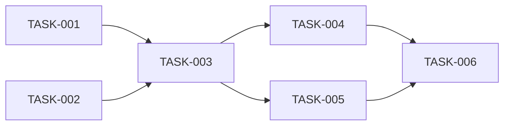

# {Project Name} — Execution Detail

> **Version:** 1.0
> **Date:** {date}
> **Source:** aid-detail (Phase 5)
> **Inputs:** PLAN.md + SPEC.md + knowledge/

---

## User Stories

### US-{id}: {Title}

**As a** {role from KB domain-glossary.md}
**I want** {capability}
**So that** {business value}

**Acceptance Criteria:**
- [ ] {Testable criterion — behavior visible to the user}
- [ ] {Criterion for edge case}
- [ ] {Criterion for error state}

**Source:** PLAN.md Deliverable {n} | SPEC.md Feature {ref}

**Size estimate:** S | M | L | XL

---

## Task List

> Each task is a single coding agent session — scoped to be completable in one run without overwhelming context.

### TASK-{id}: {Name}

**User Story:** US-{id} | **Delivery:** DELIVERY-{id} | **Complexity:** S | M | L | XL

**Objective:** {1-2 sentences: what this task accomplishes and why it matters}

**Interface Contracts:**
```csharp
// Public interfaces this task introduces or modifies
// Language-specific — use the language from KB technology-stack.md
```

**Architecture notes:**
{How this fits the existing system. Reference KB architecture.md section.}

**Acceptance Criteria:**
- [ ] {Concrete, testable criterion}
- [ ] Build passes with zero errors
- [ ] Unit tests pass

**Test Requirements:**
- Unit: {what to test, expected count}
- Integration: {if applicable}
- Edge cases: {explicitly list}

**Files to Touch (guidance, not mandate):**
- Create: `{path/to/new/file}`
- Modify: `{path/to/existing/file}` — {what changes}

**Depends On:** TASK-{id} | None
**Blocks:** TASK-{id} | None

---

## Precedence Graph

> Shows which tasks must complete before others can start.



> Or in text form:
```
TASK-001 → TASK-003
TASK-002 → TASK-003
TASK-003 → TASK-004, TASK-005
TASK-004, TASK-005 → TASK-006
```

---

## Delivery Breakdown

### DELIVERY-{id}: {Name}

**User Stories:** US-{id}, US-{id}
**Tasks:** TASK-{id}, TASK-{id}

**Success Criteria:**
- {measurable criteria that define "done" for this delivery}

**Depends on:** DELIVERY-{id} | None

---

## Execution Plan

> Groups tasks into waves. Tasks in the same wave can execute in parallel (independent of each other).

### Wave 1 (parallel — no dependencies)
- TASK-{id}: {name}
- TASK-{id}: {name}

### Wave 2 (after Wave 1 completes)
- TASK-{id}: {name} (depends on TASK-{id})
- TASK-{id}: {name} (depends on TASK-{id})

### Wave 3 (sequential — depends on Wave 2)
- TASK-{id}: {name} (integrates Wave 2 outputs)

---

## Revision History

| Rev | Date | Source | Description |
|-----|------|--------|-------------|
| 1.0 | {date} | aid-detail | Initial decomposition |
