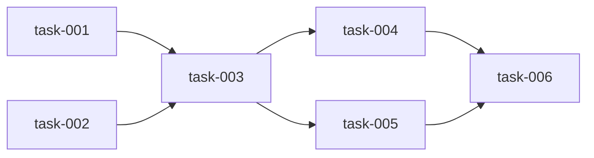

# {Project Name} — Execution Detail

> **Version:** 1.0
> **Date:** {date}
> **Source:** aid-detail (Phase 5)
> **Inputs:** PLAN.md + SPEC.md + .aid/knowledge/

---

## User Stories

### US-{id}: {Title}

**As a** {role from KB domain-glossary.md}
**I want** {capability}
**So that** {business value}

**Acceptance Criteria:**
- [ ] {Testable criterion — behavior visible to the user}
- [ ] {Criterion for edge case}
- [ ] {Criterion for error state}

**Source:** PLAN.md Deliverable {n} | SPEC.md Feature {ref}

**Size estimate:** S | M | L | XL

---

## Task List

> Each task is a single coding agent session — scoped to be completable in one run without overwhelming context.

### task-{id}: {Name}

**User Story:** US-{id} | **Delivery:** DELIVERY-{id} | **Complexity:** S | M | L | XL

**Objective:** {1-2 sentences: what this task accomplishes and why it matters}

**Interface Contracts:**
```csharp
// Public interfaces this task introduces or modifies
// Language-specific — use the language from KB technology-stack.md
```

**Architecture notes:**
{How this fits the existing system. Reference KB architecture.md section.}

**Acceptance Criteria:**
- [ ] {Concrete, testable criterion}
- [ ] Build passes with zero errors
- [ ] Unit tests pass

**Test Requirements:**
- Unit: {what to test, expected count}
- Integration: {if applicable}
- Edge cases: {explicitly list}

**Files to Touch (guidance, not mandate):**
- Create: `{path/to/new/file}`
- Modify: `{path/to/existing/file}` — {what changes}

**Depends On:** task-{id} | None
**Blocks:** task-{id} | None

---

## Precedence Graph

> Shows which tasks must complete before others can start.



> Or in text form:
```
task-001 → task-003
task-002 → task-003
task-003 → task-004, task-005
task-004, task-005 → task-006
```

---

## Delivery Breakdown

### DELIVERY-{id}: {Name}

**User Stories:** US-{id}, US-{id}
**Tasks:** task-{id}, task-{id}

**Success Criteria:**
- {measurable criteria that define "done" for this delivery}

**Depends on:** DELIVERY-{id} | None

---

## Execution Plan

> Groups tasks into waves. Tasks in the same wave can execute in parallel (independent of each other).

### Wave 1 (parallel — no dependencies)
- task-{id}: {name}
- task-{id}: {name}

### Wave 2 (after Wave 1 completes)
- task-{id}: {name} (depends on task-{id})
- task-{id}: {name} (depends on task-{id})

### Wave 3 (sequential — depends on Wave 2)
- task-{id}: {name} (integrates Wave 2 outputs)

---

## Integration Contract

> Every delivery must define how it integrates with the running application.
> This prevents the class of bugs where isolated unit tests pass but the actual application is broken.

### Scene Tree / Component Additions
After this delivery, the application MUST contain these components (cumulative with prior deliveries):
- {List all scene tree nodes, services, controllers, or modules this delivery adds}
- {Include parent→child relationships}
- {Note any visual components that must have actual visible content (meshes, sprites, UI elements)}

### Bootstrap / Initialization Changes
{How this delivery extends the application startup sequence. Reference the Initialization section in REQUIREMENTS.md if it exists.}
- {New autoloads, services, or entry points}
- {Signal connections established during initialization}
- {Ownership transfers from previous deliveries (e.g., "System X now owns responsibility Y, replacing the temporary implementation from delivery-N")}
- Or: "No changes — inherits from delivery-{N}"

### Visual / Functional Smoke Test
Run the application. A human (or automated smoke test) MUST observe:
- [ ] {Observable behavior — what you see, hear, or can interact with}
- [ ] {Include negative tests: "X does NOT happen"}
- [ ] {Reference prior delivery smoke tests: "Everything from delivery-{N} still works"}

### Dev Environment Requirements
{Any environment setup needed to test this delivery that isn't already in place}
- Or: "No additional requirements beyond delivery-{N}"

> **Why this section exists:** Unit tests verify isolated system behavior. Integration Contracts verify that systems are actually wired together in the running application. Both are necessary.

---

## Revision History

| Rev | Date | Source | Description |
|-----|------|--------|-------------|
| 1.0 | {date} | aid-detail | Initial decomposition |
