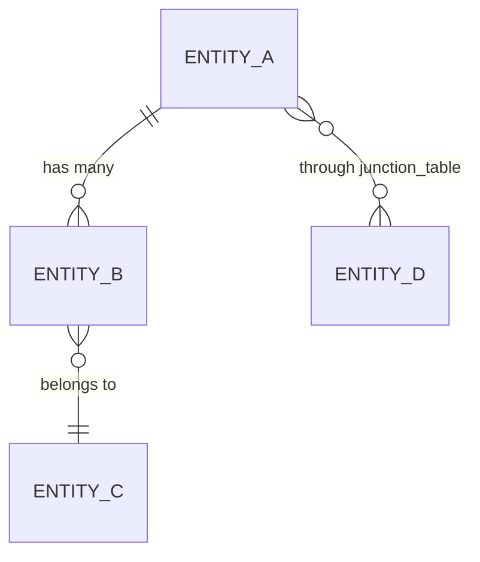

# Data Model

> **Source:** wf-discover (Phase 1)
> **Status:** {✅ Complete | ⚠️ Partial | ❌ Missing}
> **Last Updated:** {date}

---

## Database

| Property | Value |
|----------|-------|
| **Type** | {PostgreSQL / MySQL / SQLite / SQL Server / MongoDB / DynamoDB / other} |
| **Version** | {version} |
| **ORM / ODM** | {EF Core / Prisma / Hibernate / SQLAlchemy / Mongoose / none} |
| **Connection string location** | {path/to/config or env var name} |
| **Multiple databases?** | {Yes: list them / No} |

---

## Schema

> Document each table/collection. For large schemas, focus on the entities with the most business logic and relationships.

### {TableName / CollectionName}

> Brief description of what this entity represents.

| Column | Type | Nullable | Key | Description |
|--------|------|----------|-----|-------------|
| `id` | {uuid / bigint / ObjectId} | No | PK | Primary key |
| `{column}` | {type} | {Yes/No} | {FK → table.col / UQ / —} | {purpose} |
| `created_at` | {timestamp} | No | — | Record creation time |
| `updated_at` | {timestamp} | Yes | — | Last modification time |

**Indexes:**
- `{index_name}` on `({columns})` — {purpose}

---

## Relationships

> Express relationships in plain English before any diagrams.

```
{Entity A} 1 ──── * {Entity B}       (one A has many B)
{Entity B} * ──── 1 {Entity C}       (many B belong to one C)
{Entity A} * ──── * {Entity D}       (many-to-many via {junction table})
```

**Entity-Relationship summary:**


---

## Migrations

| Property | Value |
|----------|-------|
| **Framework** | {EF Core Migrations / Flyway / Alembic / Liquibase / manual} |
| **Location** | {path/to/migrations/} |
| **Naming convention** | {e.g., `{timestamp}_{description}` / `V{n}__{description}`} |
| **Latest migration** | {migration name / number} |
| **Auto-applied on startup?** | {Yes / No — run manually via CI} |

---

## Soft Deletes

| Property | Value |
|----------|-------|
| **Used?** | {Yes: which tables / No} |
| **Mechanism** | {`deleted_at` timestamp / `is_deleted` boolean / other} |
| **Filtered in ORM?** | {Yes — global query filter / No — manual where clause} |

---

## Notable Data Patterns

> Patterns that affect how agents should write queries and migrations.

- {e.g., "All timestamps are stored in UTC. Application converts to local time on display."}
- {e.g., "Audit trail: all inserts/updates to Orders are duplicated in orders_audit."}
- {e.g., "UUIDs used as PKs everywhere — no auto-increment integers."}
- {e.g., "JSON columns used in config table for flexible key-value storage."}

---

## Data Volume

> Rough order of magnitude — important for query design and indexing decisions.

| Table | Rows (approx.) | Growth Rate | Notes |
|-------|---------------|-------------|-------|
| {table} | {100K / 1M / 100M} | {stable / 10K/day / other} | |

---

## Revision History

| Rev | Date | Source | Description |
|-----|------|--------|-------------|
| 1.0 | {date} | wf-discover | Initial schema extraction |
