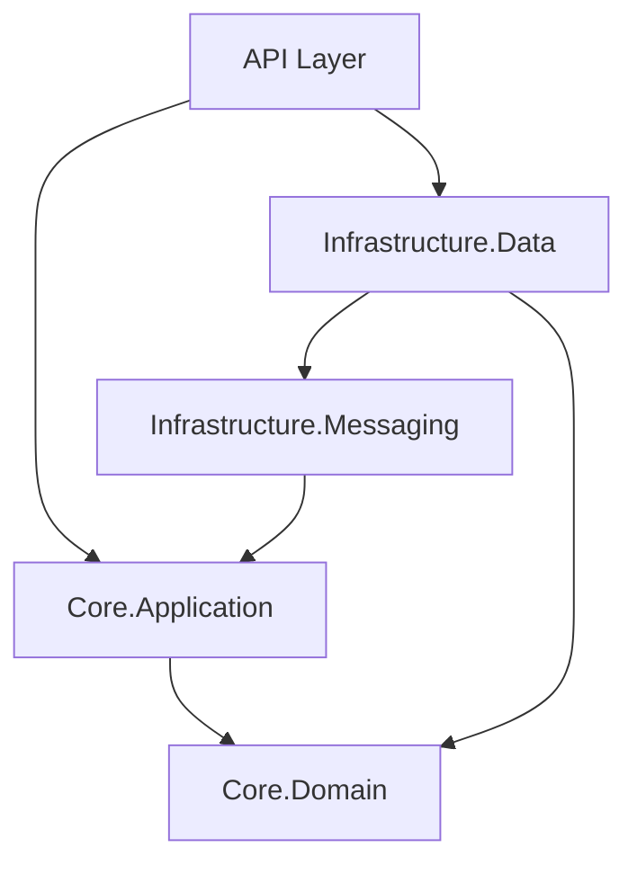

# Module Map

> **Source:** wf-discover (Phase 1)
> **Status:** {✅ Complete | ⚠️ Partial | ❌ Missing}
> **Last Updated:** {date}

---

## Module Inventory

> List every significant module, package, or project. For large codebases, focus on modules that contain business logic — skip pure infrastructure scaffolding.

| Module | Purpose | Dependencies | Files | Test Coverage | Notes |
|--------|---------|-------------|-------|--------------|-------|
| {module-name} | {what it does in one sentence} | {list of modules it imports} | {count} | {✅ tested / ⚠️ partial / ❌ none} | {tech debt, warnings} |
| {module-name} | {what it does} | {deps} | {count} | {coverage} | |

**Example:**
| Module | Purpose | Dependencies | Files | Test Coverage | Notes |
|--------|---------|-------------|-------|--------------|-------|
| `Core.Domain` | Entities, value objects, domain events | none | 47 | ✅ 89% | Pure domain — no infrastructure deps |
| `Core.Application` | Use cases, command/query handlers | `Core.Domain` | 63 | ⚠️ 41% | Missing tests for edge cases in OrderService |
| `Infrastructure.Data` | EF Core context, repositories | `Core.Domain`, `Core.Application` | 38 | ❌ 0% | No repository tests |
| `Infrastructure.Messaging` | RabbitMQ integration | `Core.Application` | 12 | ❌ 0% | |
| `API` | ASP.NET controllers, middleware | All | 29 | ⚠️ 60% | Integration tests exist but slow |

---

## Dependency Graph

> Show which modules import which. Arrows point from importer to dependency.



> If mermaid isn't available, use text:
```
API → Core.Application
API → Infrastructure.Data
Core.Application → Core.Domain
Infrastructure.Data → Core.Domain
Infrastructure.Messaging → Core.Application
```

---

## Entry Points

| Entry Point | Module | Type | Description |
|-------------|--------|------|-------------|
| {path/to/file} | {module} | {HTTP / CLI / background / test} | {what it starts} |

---

## High-Churn Modules

> Modules changed most frequently in recent git history — higher bug risk, higher review priority.

| Module | Commits (last 90d) | Last Changed | Risk |
|--------|--------------------|--------------|------|
| {module} | {n} | {date} | {High / Medium / Low} |

---

## Module Size Distribution

> Flag outliers — very large modules often indicate poor separation of concerns.

| Size Bucket | Count | Modules |
|-------------|-------|---------|
| Large (>100 files) | {n} | {list} |
| Medium (20-100 files) | {n} | {list} |
| Small (<20 files) | {n} | {list} |

**⚠️ Oversized modules to watch:** {list any >100 files — these often hide complexity}

---

## Revision History

| Rev | Date | Source | Description |
|-----|------|--------|-------------|
| 1.0 | {date} | wf-discover | Initial discovery |
